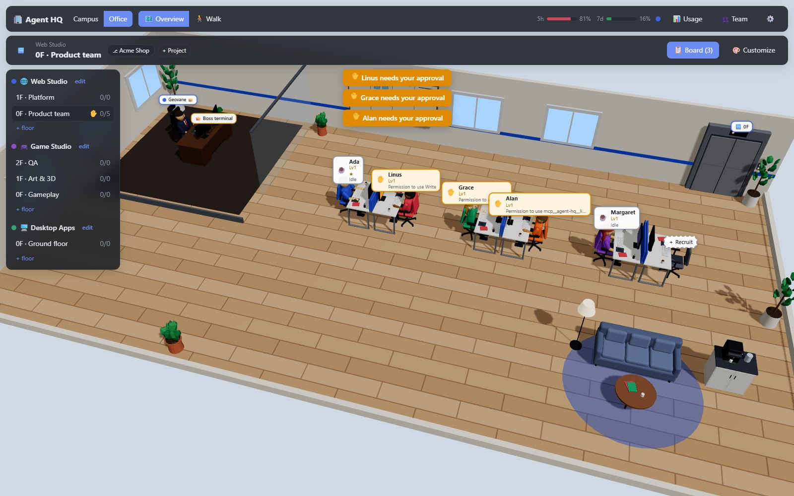
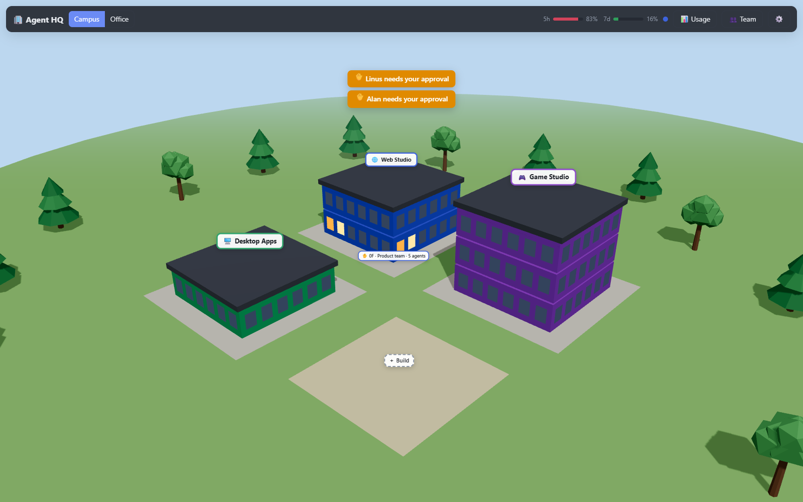
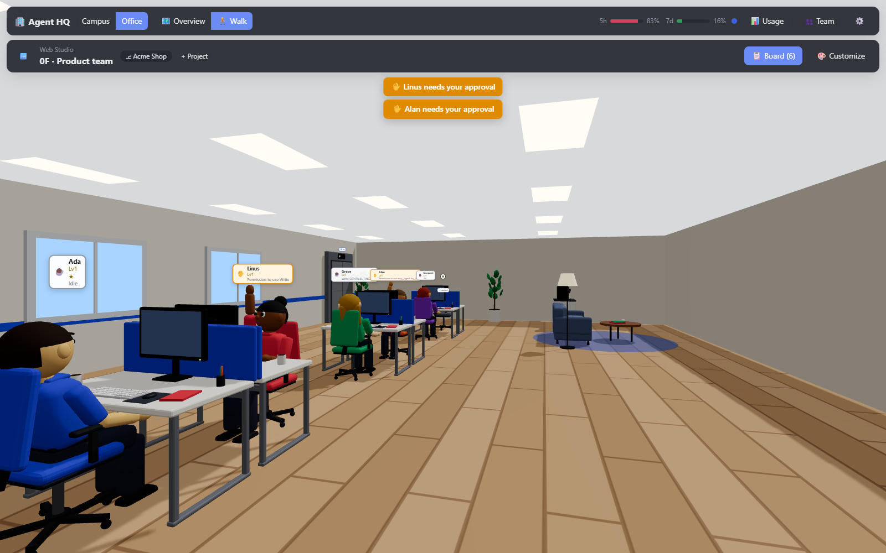
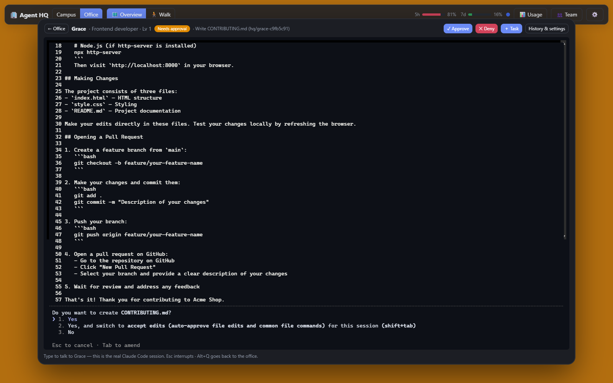
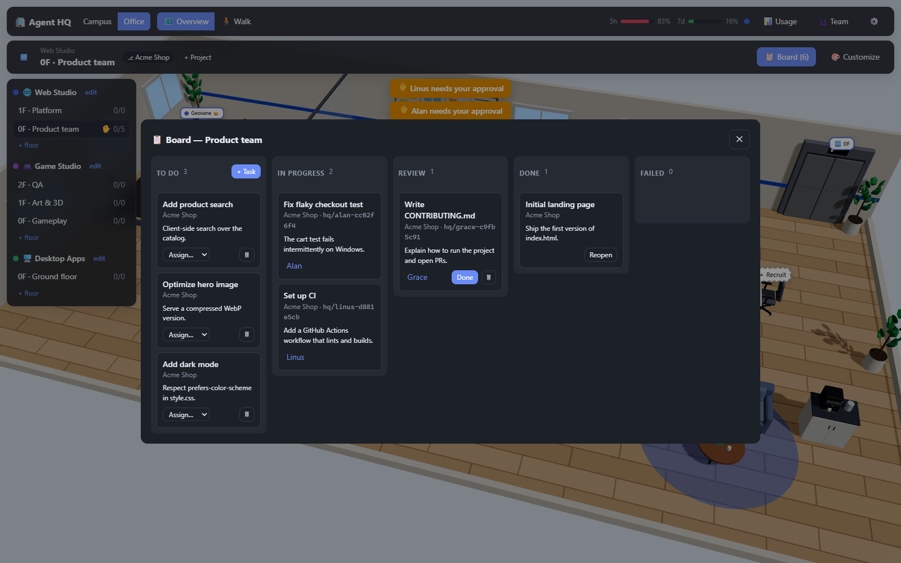
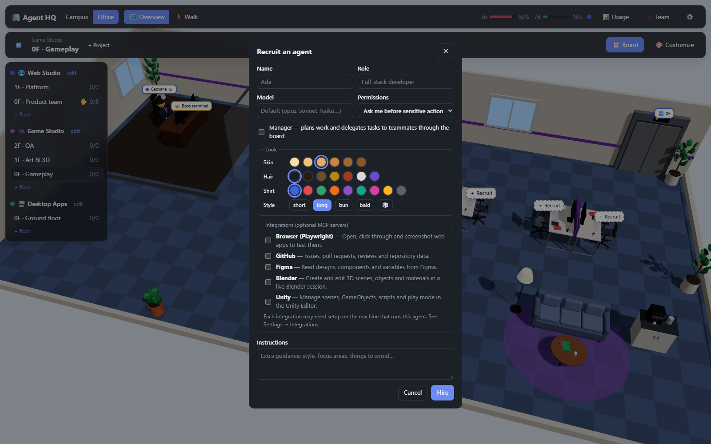
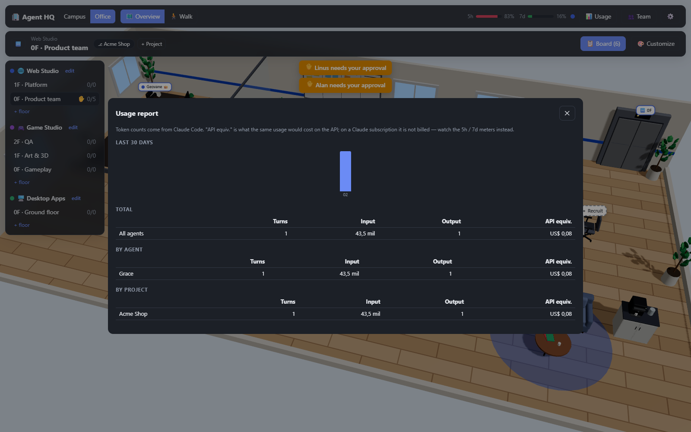
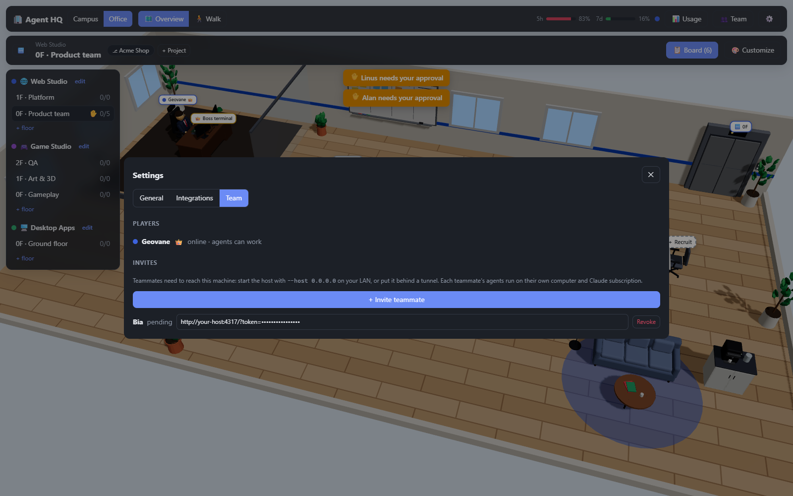

<div align="center">

# 🏢 Agent HQ

**A 3D virtual office where AI agents are your employees.**

[](LICENSE)
[](https://nodejs.org)
[](#requirements)
[](https://claude.com/claude-code)
[](CONTRIBUTING.md)

[Features](#features) · [Screenshots](#screenshots) · [Quick start](#quick-start) · [How to play](#how-to-play) ·
[Multiplayer](#multiplayer) · [Architecture](docs/ARCHITECTURE.md) · [Contributing](CONTRIBUTING.md)

</div>

Instead of juggling terminals, you run a company. Build a campus of studios, hire AI developers, hand out tasks on a
whiteboard and walk up to anyone's desk to see exactly what they're doing. Every employee is a real
[Claude Code](https://claude.com/claude-code) session running in its own git worktree, and clicking their computer zooms
into their monitor so you can type straight into their terminal.



> **Status:** early, but fully playable. Feedback and contributions are welcome.

---

## Features

**The office**
- **3D office and campus**: buildings for each kind of work (web, desktop, games), floors for teams or projects, all
  rendered with React Three Fiber.
- **Two cameras**: an overview you can rotate, pan and zoom, and a first-person mode where you walk around with WASD,
  with collisions, a ceiling and a crosshair to use things.
- **Living agents**: avatars type while their agent works, wave when it needs your approval, put their hands on their
  heads on errors and lean back when idle. Monitors scroll code or blink.
- **Customizable**: building colors, floor materials, wall and accent colors, decor, desks per floor ("expand the
  office") and each agent's look.
- **Blender-made models**: characters with six animation clips and all the furniture are generated by a Blender
  script and shipped as glTF, so you don't need Blender to play.

**The work**
- **The real Claude Code terminal, per agent**: click an agent's computer and the camera flies into the monitor, showing
  their actual Claude Code session (xterm.js on a PTY). Type to them, approve prompts, interrupt with Esc.
- **Hooks-driven status**: Claude Code hooks and its statusline tell the office what every agent is doing, when it needs
  permission and when a turn ends.
- **Whiteboards**: Excalidraw boards the whole team draws on at once, with live cursors. Open one from the easel next
  to the task board, the meeting room's wall or Menu → Whiteboards; drawings are saved in the office.
- **Task board**: the whiteboard holds To do / In progress / Review / Done. Assign tasks yourself or turn on
  auto-dispatch so idle agents on a floor pick them up.
- **Isolated work**: each task runs in its own git worktree on an `hq/<agent>-<task>` branch. Marking a task done
  cleans up the worktree and keeps the branch for you to merge.
- **Coordinators**: hire an agent as a coordinator and it plans work and delegates tasks to teammates through the built-in
  `agent-hq` MCP tools.
- **Persistent memory**: each agent keeps notes per project that survive tasks and restarts.
- **Approvals or auto mode**: per agent, from "ask me before sensitive actions" to Claude Code's auto mode.
- **Usage report**: tokens and API-equivalent cost per agent, project and day, plus your subscription's 5-hour and
  7-day meters in the HUD.
- **The balcony crew**: the agents a repository defines in `.claude/agents` hang out on the office balcony, smoking.
  Summon one with a job and it walks to a hot desk and runs `claude --agent <name>` (read-only agents work in the
  repository itself, agents that edit get their own worktree and branch). When it's done it mails you a report and goes
  back to the balcony. They can't be fired. Every floor has a balcony; until its projects define agents it only has
  empty benches (click them for how to add some, and to re-scan).
- **Boss computer**: your mail: reports from the crew (reply to keep the conversation going: the agent resumes the same
  Claude Code session) and e-mail with your teammates, with their characters' portraits and a private, persistent
  history. For the owner, also a private shell on the host. Mail is reachable from any agent's monitor and the menu too.
- **Optional integrations**: give individual agents MCP servers for browser testing (Playwright), GitHub, Figma,
  Blender or Unity, or add your own.

**Together**
- **Multiplayer**: invite teammates into your office. Their agents run on their own machines with their own Claude
  login through a lightweight runner; everyone sees everyone walking around, and the boss wears a suit.
- **Voice chat**: talk to the players near your avatar (volume fades with distance, nobody hears you from another
  floor) or switch to the company-wide channel. Mic off by default, push-to-talk on `V`, device selection, per-player
  volume and mute, and a ring on whoever is talking.
- **Meeting room**: every floor has one, with a table, a big wall screen and a whiteboard on the wall. Walk in (or click
  *Join meeting*) to be in the room's voice channel; share your screen and it plays on the wall and full size for
  everyone in the meeting.
- **Desktop app**: runs as an Electron app by default; a browser version is available too.

## Screenshots

| | |
|---|---|
|  **Campus**: one tower per studio; lit windows show who's working. |  **Walk mode**: first person, with collisions and a crosshair. |
|  **An agent's monitor**: the real Claude Code session, here asking to create a file. |  **Task board**: worktree branches, assignees and review. |
|  **Recruiting**: role, model, permissions, look, coordinator and integrations. |  **Usage report**: per agent, project and day. |
|  **Team**: players and invite links. | |

## Requirements

- **Node.js 22.18 or newer**
- **Claude Code**, installed and logged in (`claude` on your PATH)
- **git**, and projects hosted on **GitHub**; the [GitHub CLI](https://cli.github.com) (`gh auth login`) lets you create
  new repositories from the game

That's all. Blender, Unity, Figma and the other tools are only needed if you enable those integrations. Agent HQ never
asks for or stores your Claude credentials: it drives the `claude` CLI you already installed, so usage counts against
your own plan.

Tested on Windows 11; macOS and Linux are supported by design (paths, shells and binary discovery are cross-platform).

## Quick start

```sh
git clone https://github.com/geovane-gc/agent-hq.git
cd agent-hq
npm install
npm run dev
```

`npm run dev` opens the Agent HQ desktop app with hot reload. Electron is downloaded automatically on the first run, and
closing the window stops everything.

| Command | What it does |
|---|---|
| `npm start` | The desktop app in production mode (builds the UI on first run) |
| `npm run dev:web` / `npm run start:web` | The same in your browser: open the printed `?token=…` link |
| `npm run join -- <host-url> --token <invite>` | Join a teammate's office as a runner (see [Multiplayer](#multiplayer)) |
| `npm run models` | Regenerate the 3D models with Blender (optional) |
| `npm run typecheck` / `npm run build` | Type-check everything / build the web UI |

The `?token=…` in the link makes you the office owner. Keep it private.

## How to play

1. **Pick a floor.** From the campus, click a building's storey, or use the elevator and the directory in the office.
2. **Add a project.** A project is a GitHub repository (Menu → Add a project): a local clone whose `origin` is on
   GitHub, or a new repository created from the game with `gh`. **Browse…** opens your system's folder chooser (or type
   the path). Tasks always belong to a project.
3. **Recruit.** Click an empty desk. Choose a name, role, model, permission mode and look; tick *Coordinator* if this agent
   should plan and delegate; pick optional integrations.
4. **Give work.** Open the board (the whiteboard, or the HUD button) and add tasks, or click an agent's computer and use
   **＋ Task**. With auto-dispatch on, idle agents pick up unassigned tasks from their floor's projects.
5. **Talk to agents.** Click an agent's computer: the camera zooms into the monitor and you are in their real Claude
   Code session. Type anything. Agents without a task are happy to just chat about the project. `Alt+Q` (or
   **← Office**) takes you back; Esc belongs to Claude Code (it interrupts).
6. **Approve.** When an agent raises its hand, answer in its terminal or with **✓ Approve** / **✕ Deny**.
7. **Review.** Finished turns move the task to *Review*. Read the branch, then mark it *Done*.

Walk mode: `W A S D` to move, `Shift` to run, mouse to look, click to use, `Esc` to release the mouse.
Overview: drag to rotate, right-drag or `W A S D` to pan, wheel to zoom.

**Voice** lives in the bottom-right corner: the mic button (red **● Live** while it transmits), 📍 *Nearby* or 🌐
*Everyone*, and the people list (devices, push-to-talk, per-player volume and mute). In proximity mode you hear players
within 8 m of your avatar on your floor (the boss can change the radius). Inside the **meeting room** (next to the boss
room) everyone in the room hears each other; **🖥 Share screen** puts your screen on the wall for the people in the
meeting, one sharer at a time. Walking out stops your share.

## Multiplayer

1. Start the host where teammates can reach it, for example `npm run start:web -- --host 0.0.0.0` on a LAN, or behind a
   tunnel.
2. **Team → Invite teammate** creates a link. The teammate opens it to walk the office, use the board and hire agents.
3. To make their agents work, the teammate runs a **runner** on their own computer, with Agent HQ installed and Claude
   Code logged in:

   ```sh
   npm run join -- http://host:4317 --token <their invite token> --repo "Project name=/path/to/their/clone"
   ```

   Projects with a git `origin` are cloned automatically when `--repo` is omitted. Remote agents push their branches
   to `origin` so the team can review them.

The building owner is the **boss**; everyone invited is a **manager**. Each agent runs on its owner's machine, on one of
their Claude accounts (connect several in **Settings → Claude accounts**; each employee's monitor shows the account's
email, plan and player, and lets its owner switch). Claude accounts are personal: only the player whose account runs an
agent can type into its terminal, approve its actions or give it board tasks. Everyone else can watch, or use
**⇄ Take over** on the monitor to move the task, its branch (committed and pushed to `origin`) and a summary of the work
so far onto their own machine and account. By default the agent's owner must approve a takeover; the boss can make it
free in Settings.

## Configuration

| Flag / env var | Default | |
|---|---|---|
| `--data-dir` / `AGENT_HQ_DATA_DIR` | `~/.agent-hq` | Database, worktrees, agent notes, owner token |
| `--port` / `AGENT_HQ_PORT` | `4317` | |
| `--host` / `AGENT_HQ_HOST` | `127.0.0.1` | Agents run commands on your machine: expose with care |
| `AGENT_HQ_CLAUDE_PATH` | auto-detected | Path to the `claude` binary |

Voice and screen sharing go peer to peer (WebRTC). **Settings → General → Voice & screen sharing** (boss only) holds
the proximity radius, the STUN servers (default: a public Google STUN server) and an optional **TURN** relay (URL,
username, credential). Players behind strict NATs or corporate firewalls can't connect without TURN (for example
[coturn](https://github.com/coturn/coturn)). The TURN credential stays on the host and is only handed to players when
they join voice. Every player connects to every other one, which works well up to about 8 people in voice.

Integrations (MCP servers) are edited in **Settings → Integrations**. Each entry is a Claude Code `mcpServers` config
plus the setup it needs (for example the Blender add-on or the Unity package).

## Project layout

```
packages/protocol   shared types: client/server protocol and runner protocol
packages/core       host server, orchestrator, runners, Claude Code adapters, hooks, HQ MCP tools, terminal, SQLite
apps/web            the game: React + Three.js (React Three Fiber) office, campus and HUD
apps/desktop        the Electron app: starts the host server and shows the office
assets/blender      the Blender script that generates every 3D model
docs                architecture notes and screenshots
```

### Regenerating the 3D models

The models in `apps/web/public/models` are built by `assets/blender/build_assets.py`. With Blender 4.2+ on your PATH:

```sh
npm run models
# or, with an explicit Blender path and preview renders:
blender --background --factory-startup --python assets/blender/build_assets.py -- \
  --out apps/web/public/models --preview ./previews
```

See [docs/ARCHITECTURE.md](docs/ARCHITECTURE.md) for how the pieces fit together.

## Security notes

- The server listens on `127.0.0.1` by default. Agents can run commands on the machine that hosts them, so only expose
  the server to people you trust, and prefer a tunnel or reverse proxy with HTTPS.
- Access is token-based: the owner token in `<data-dir>/owner-token`, one token per invite, and short-lived tokens for
  each agent's MCP tools.
- Agent HQ never handles Claude credentials. Each player's agents use that player's own Claude Code login.
- Voice: the mic is never on until you turn it on, and the HUD shows when it is live or your screen is shared. Audio
  and screens travel directly between players' computers, so players in voice together can see each other's IP
  address. Agents are never part of voice.
- Folder trust: Claude Code asks whether to trust new folders. Agent HQ answers "yes" only for the worktrees and scratch
  folders it creates from repositories you added.

To report a vulnerability, see [SECURITY.md](SECURITY.md).

## Contributing

Bug reports, ideas and pull requests are welcome. Read [CONTRIBUTING.md](CONTRIBUTING.md) to get set up, and note that
this project follows a [Code of Conduct](CODE_OF_CONDUCT.md).

## License

[MIT](LICENSE)
